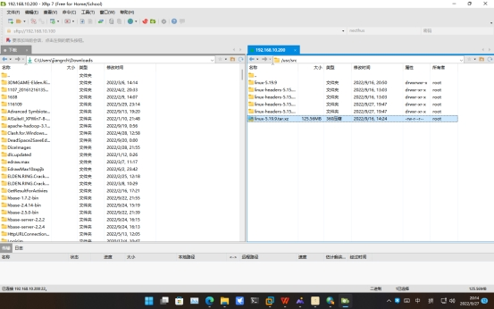
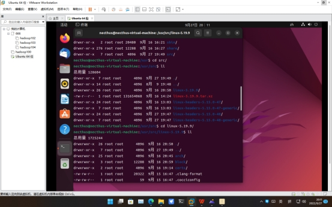
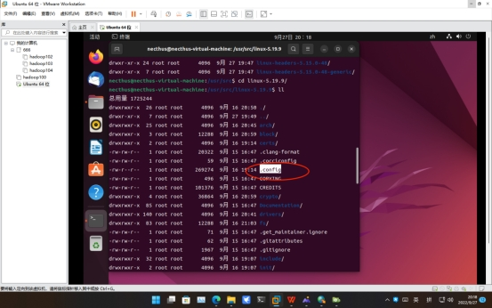
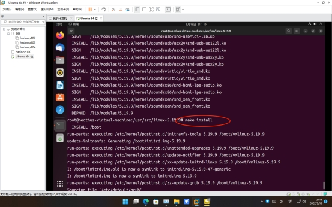
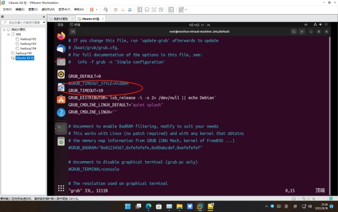
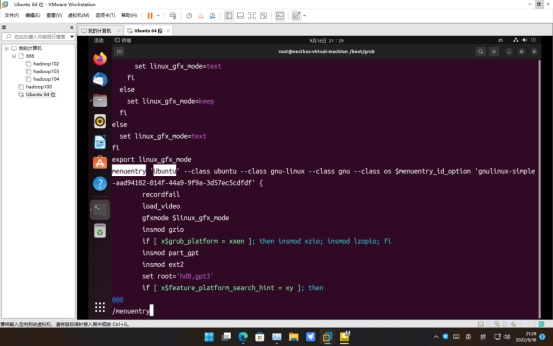
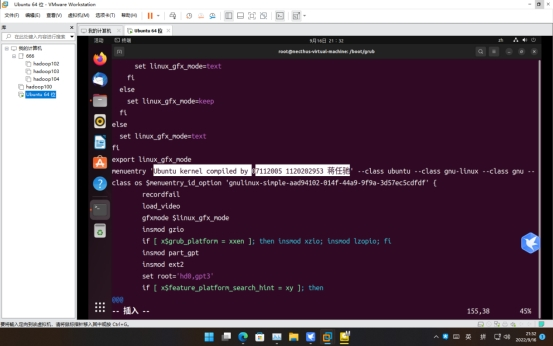

# 操作系统课程设计实验报告

实验名称：Linux内核编译

## 一、实验目的

编译Linux内核，了解编译过程

## 二、实验内容

编译Linux内核，并安装到自己的Linux系统中，更改grub引导文件，使开机引导界面显示自己的个人信息。

## 三、实验环境

VMware WorkStation 16 Pro

Ubuntu 22.04.1

Linux kernel 5.19.9

## 四、程序设计与实现

1. 在www.kernel.org官网上下载最新Linux内核（5.19.9）

2. 下载ubuntu镜像和VMware WorkStation，创建虚拟机。
3. 利用Xftp将内核文件传到虚拟机中，解压。

 

4. 用`apt install`命令安装`libcurses`, `build-essential`, `kernel-package`等软件包，为编译提供支持。

5. 切换到解压文件夹下，执行`sudo make menuconfig`，生成配置文件，不改动并保存。

 

 

6. 执行`sudo make`命令，开始编译内核。

7. 执行`sudo make modules_install`，把编译好的模块拷贝到系统相应目录下。

8. 执行`sudo make install`，开始安装内核到系统中。

9. 用vim修改`/etc/default/grub`文件，查看`GRUB_TIMEOUT_STYLE =hidden`是否存在，存在则删去或注释掉，检查GRUB_DISTRIUBUTOR_TIMEOUT是否为正值，不是则改为正，取消引导菜单的隐藏，使引导菜单一定时间后再跳过。之后执行`sudo update-grub`，应用此文件。

 

10. 用vim修改`/boot/grub/grub.cfg`文件，在命令模式下输入/查找`menuentry`，后面的字符串即为启动菜单选项显示值，修改它的值，即可自定义启动菜单时的选项名称。

 

11. 重启Ubuntu，查看效果。

## 五、实验收获与体会 

实验中遇到的困难，如何解决的。实验经历及体会收获。

1. make install出现磁盘空间不足。

   解决方法：在VMware WorkStation中，多分配给虚拟机30G以上空间，再进入Ubuntu中使用磁盘管理工具把多分配的空间全部划入挂载点中。

2. Kernel-package安装不了，在软件源里找不到。

   解决方法：我是用阿里云镜像，不可能出现有缺失软件包，说明出现了替代软件包。但没有找到，最后手动下载`kernel-package.deb`文件安装。

3. 多次No such file or directory。

   解决方法：apt安装对应缺失软件包即可。

 

实验经历及体会收获：因为乐学上发布的各种软件和方法都较老，所以需要很多自己查询的部分，这期间提升了自己的解决问题的能力。