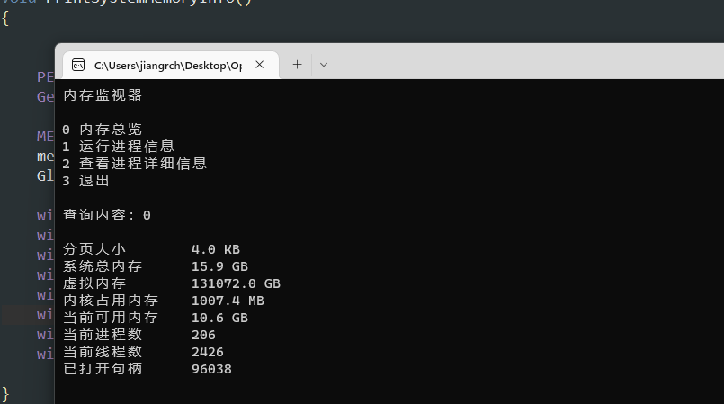
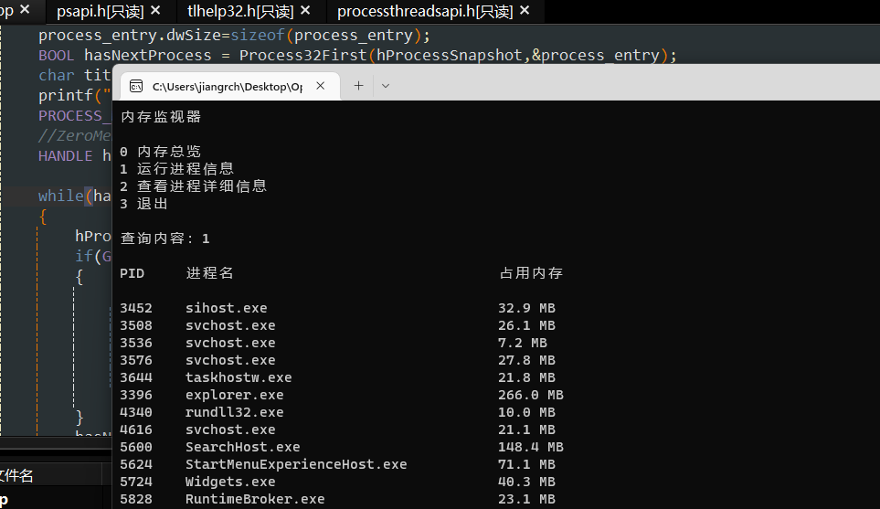
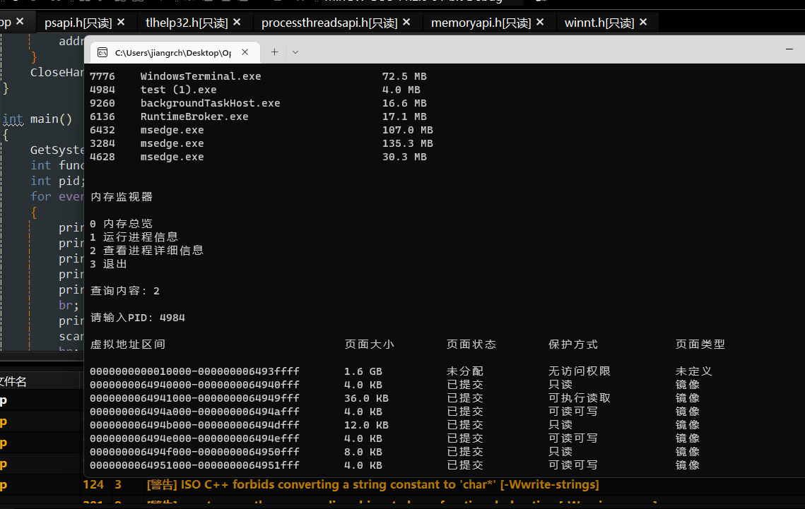

# **操作系统课程设计实验报告**

实验名称：实验三 内存和进程地址空间实时显示

## 一、实验目的

实验要求学生编写C语言，通过Windows的系统级API实现内存监视器。在实验过程中，通过调用API并进行组合，能更好地理解操作系统中内存的布局、页式内存管理，以及内存的各种保护方式等。

## 二、实验内容

设计一个内存监视器，能实时地显示当前系统中内存的使用情况，包括物理内存的使用情况；能实时显示某个进程的虚拟地址空间布局信息等等。

相关的系统调用：  

`GetSystemInfo` `VirtualQueryEx` `GetPerformanceInfo` `GlobalMemoryStatusEx` …

## 三、实验环境

**Windows环境**

- 操作系统：Windows 11 WorkStation 21H2 

- IDE: Red Panda C++

- 编译器版本：GCC 11.2.0

## 四、程序设计与实现

定义一些宏方便使用

```c++
#define ever (;;) //永久循环
#define br printf("\n") //换行
#define print(x) cout<<x<<endl //输出
#define with_description(description,content) cout<<description<<"\t"<<content<<endl; //带描述的输出
#define with_description_format(description,content) cout<<description<<"\t"<<formatByte(content)<<endl; //格式化数据带描述输出
```


定义格式化字节数函数，输入字节数，输出以GB、MB、KB、B表示的字节数字符串

```c++
char* formatByte(DWORDLONG byte_num)
{
	constexpr K(1024);
	constexpr M(K*1024);
	constexpr G(M*1024);

	if(byte_num>=G) sprintf(buffer,"%.1f GB",byte_num/(float)G);
	else if(byte_num>=M) sprintf(buffer,"%.1f MB",byte_num/(float)M);
	else if(byte_num>=K) sprintf(buffer,"%.1f KB",byte_num/(float)K);
	else sprintf(buffer,"%.1f B",byte_num/1.0);
	return buffer;
}
```


设计内存监视器，分为三个部分：

- 内存总览
- 运行进程信息
- 查看进程详细信息（需提供进程PID）


在main函数中，输入不同的序号，即可调用不同的功能

```c++
int main()
{
	GetSystemInfo(&sys_info);
	int func;
	int pid;
	for ever
	{
		printf("内存监视器\n\n");
		printf("0 内存总览\n");
		printf("1 运行进程信息\n");
		printf("2 查看进程详细信息\n");
		printf("3 退出\n");
		br;
		printf("查询内容：");
		scanf("%d",&func);
		br;
		switch (func) {
		case 0:
			PrintSystemMemoryInfo();
			break;
		case 1:
			CheckRunningProcesses();
			break;
		case 2:
			printf("请输入PID：");
			scanf("%d",&pid);
			br;
			PrintProcessAddressDistribution(pid);
			break;
		case 3:
			return 0;
		default:
			printf("无效，请重新输入\n");
		}
		br;br;
	}
}
```


`GetSystemInfo (LPSYSTEM_INFO lpSystemInfo)`函数可以获取系统信息，因为系统信息在程序运行中是不变的，定义全局变量`SYSTEM_INFO sys_info`，在主函数中就调用获取系统信息函数，这样在其他函数中就不用重复获取系统信息了。

```c++
typedef struct _SYSTEM_INFO {
    __C89_NAMELESS union {
        DWORD dwOemId;
        __C89_NAMELESS struct {
            WORD wProcessorArchitecture;//处理器架构
            WORD wReserved;
        } DUMMYSTRUCTNAME;
    } DUMMYUNIONNAME;
    DWORD dwPageSize;//分页大小
    LPVOID lpMinimumApplicationAddress;//进程可以最小虚拟地址
    LPVOID lpMaximumApplicationAddress;//进程可用最大虚拟地址
    DWORD_PTR dwActiveProcessorMask;
    DWORD dwNumberOfProcessors;//处理器数量
    DWORD dwProcessorType;//处理器类型
    DWORD dwAllocationGranularity;
    WORD wProcessorLevel;//处理器级别
    WORD wProcessorRevision;//处理器修订版本
} SYSTEM_INFO, *LPSYSTEM_INFO;
```


### 内存总览

系统内存相关信息可以通过一些函数获得，都需要传入相应结构体储存返回信息


#### `GetPerformanceInfo`

获得进程数、线程数、已使用句柄、以及内存占用等信息：

```c++
WINBOOL WINAPI GetPerformanceInfo (
    PPERFORMACE_INFORMATION pPerformanceInformation,//结构体指针
    DWORD cb//结构体大小
);
```

```c++
typedef struct _PERFORMANCE_INFORMATION {
    DWORD cb;
    SIZE_T CommitTotal;
    SIZE_T CommitLimit;
    SIZE_T CommitPeak;
    SIZE_T PhysicalTotal;
    SIZE_T PhysicalAvailable;
    SIZE_T SystemCache;
    SIZE_T KernelTotal;
    SIZE_T KernelPaged;
    SIZE_T KernelNonpaged;
    SIZE_T PageSize;
    DWORD HandleCount;
    DWORD ProcessCount;
    DWORD ThreadCount;
} PERFORMANCE_INFORMATION,*PPERFORMANCE_INFORMATION,PERFORMACE_INFORMATION,*PPERFORMACE_INFORMATION;
```

调用代码

```c++
PERFORMANCE_INFORMATION per_info;
GetPerformanceInfo(&per_info,sizeof(PERFORMANCE_INFORMATION));
```


#### `GlobalMemoryStatusEx`

获取系统内存的详细信息，包括物理内存、虚拟内存、页文件的总大小和可用大小等

```c++
WINBASEAPI WINBOOL WINAPI GlobalMemoryStatusEx (LPMEMORYSTATUSEX lpBuffer//结构体指针);
```

```c++
typedef struct _MEMORYSTATUSEX {
	DWORD dwLength;
    DWORD dwMemoryLoad;
    DWORDLONG ullTotalPhys;
    DWORDLONG ullAvailPhys;
    DWORDLONG ullTotalPageFile;
    DWORDLONG ullAvailPageFile;
    DWORDLONG ullTotalVirtual;
    DWORDLONG ullAvailVirtual;
    DWORDLONG ullAvailExtendedVirtual;
} MEMORYSTATUSEX,*LPMEMORYSTATUSEX;
```

调用代码：

```c++
MEMORYSTATUSEX mem_stat;
mem_stat.dwLength=sizeof(MEMORYSTATUSEX);
GlobalMemoryStatusEx(&mem_stat);
```

#### 运行截图




### 运行进程信息


#### 获取系统进程快照

系统运行的进程是在不断变化的，要获取有哪些进程正在运行，需要先获取一个进程的快照，即某一时刻系统中有哪些进程。

```c++
HANDLE WINAPI CreateToolhelp32Snapshot(DWORD dwFlags,DWORD th32ProcessID);
```

`dwFlags`为函数参数，为以下宏之一，指定要获取进程、线程、还是某一进程内的内容的快照等等

```c++
#define TH32CS_SNAPHEAPLIST 0x00000001
#define TH32CS_SNAPPROCESS 0x00000002
#define TH32CS_SNAPTHREAD 0x00000004
#define TH32CS_SNAPMODULE 0x00000008
#define TH32CS_SNAPMODULE32 0x00000010
#define TH32CS_SNAPALL (TH32CS_SNAPHEAPLIST | TH32CS_SNAPPROCESS | TH32CS_SNAPTHREAD | TH32CS_SNAPMODULE)
#define TH32CS_INHERIT 0x80000000
```

当指定为TH32CS_SNAPPROCESS，即获取所有进程快照，此时不需要指定进程PID，`th32ProcessID`无效，可置为0

函数返回一个快照的句柄

#### 逐条获取进程信息

首先要获取快照中第一条进程信息

```c++
WINBOOL WINAPI Process32First(
    HANDLE hSnapshot,//快照句柄
    LPPROCESSENTRY32 lppe//指向进程条目结构体的指针
);//返回值为BOOL值，获取成功返回True，失败返回False
```

```c++
typedef struct tagPROCESSENTRY32 {
    DWORD dwSize;
    DWORD cntUsage;
    DWORD th32ProcessID;//进程ID，即PID
    ULONG_PTR th32DefaultHeapID;
    DWORD th32ModuleID;
    DWORD cntThreads;
    DWORD th32ParentProcessID;
    LONG pcPriClassBase;
    DWORD dwFlags;
    CHAR szExeFile[MAX_PATH];//进程名称
} PROCESSENTRY32;
typedef PROCESSENTRY32 *PPROCESSENTRY32;
typedef PROCESSENTRY32 *LPPROCESSENTRY32;
```

`PROCESSENTRY32`结构体中保存了PID，进程名等信息

之后依次获取下一条进程信息，反复调用`Process32Next`函数，并接受返回值，返回值为False则退出循环

```c++
WINBOOL WINAPI Process32Next(
    HANDLE hSnapshot,
    LPPROCESSENTRY32 lppe
);
```

#### 获取进程占用内存大小

根据`PROCESSENTRY32`，我们仅知道系统中进程的PID以及名称，我们还想获取进程占用了多少内存，需要利用函数

```c++
WINBOOL WINAPI GetProcessMemoryInfo(
    HANDLE Process,//进程句柄
    PPROCESS_MEMORY_COUNTERS ppsmemCounters,//保存进程内存的结构体指针
    DWORD cb//结构体大小
);
```

```c++
typedef struct _PROCESS_MEMORY_COUNTERS {
    DWORD cb;
    DWORD PageFaultCount;
    SIZE_T PeakWorkingSetSize;//最大工作集大小
    SIZE_T WorkingSetSize;//工作集大小，即实际占用内存大小
    SIZE_T QuotaPeakPagedPoolUsage;
    SIZE_T QuotaPagedPoolUsage;
    SIZE_T QuotaPeakNonPagedPoolUsage;
    SIZE_T QuotaNonPagedPoolUsage;
    SIZE_T PagefileUsage;
    SIZE_T PeakPagefileUsage;
} PROCESS_MEMORY_COUNTERS;
typedef PROCESS_MEMORY_COUNTERS *PPROCESS_MEMORY_COUNTERS;
```

通过`WorkingSetSize`就可以获取进程占用内存信息了

`GetProcessMemoryInfo`还需要进程句柄，我们已经得知PID，只需要利用函数

```c++
WINBASEAPI HANDLE WINAPI OpenProcess (
    DWORD dwDesiredAccess,//句柄权限
    WINBOOL bInheritHandle, //是否进程父进程的句柄吗，选False
    DWORD dwProcessId//进程PID
);
```


#### 运行截图




### 查看进程详细信息

要打印进程内存的详细信息，需要函数

```c++
WINBASEAPI SIZE_T WINAPI VirtualQueryEx (
    HANDLE hProcess, //进程句柄
    LPCVOID lpAddress, //要获取信息的虚拟内存基地址
    PMEMORY_BASIC_INFORMATION lpBuffer, //指向保存内存信息的结构体的指针
    SIZE_T dwLength //结构体大小
);
```

函数向`MEMORY_BASIC_INFORMATION`结构体中写入值，结构体保存了一段虚拟内存中的各种信息

```c++
typedef struct _MEMORY_BASIC_INFORMATION {
    PVOID BaseAddress; //基地址
    PVOID AllocationBase; //分配空间时的基地址
    DWORD AllocationProtect; //分配内存时指定的内存保护方式
    SIZE_T RegionSize; //内存区域大小
    DWORD State; //内存状态
    DWORD Protect; //内存保护方式
    DWORD Type; //内存类型
} MEMORY_BASIC_INFORMATION,*PMEMORY_BASIC_INFORMATION;
```


全局变量`sys_info`已经保存了进程可使用的最低虚拟内存地址，我们指定遍历进程内存空间的起始地址为这个值

```c++
LPBYTE address_start = (LPBYTE)sys_info.lpMinimumApplicationAddress;
```

将这个值传递给`VirtualQueryEx`，通过`MEMORY_BASIC_INFORMATION`获取一段内存的信息。

要获取下一段内存的基地址，简单地加上内存区域的大小

```c++
address_next = address_start+memory_info.RegionSize;
//......
address_start=address_next;
```

循环条件为

```c++
while(address_start<sys_info.lpMaximumApplicationAddress)
```

其中`sys_info.lpMaximumApplicationAddress`为进程可以使用的最高虚拟内存地址


#### 运行截图




## 五、实验收获与体会

在本次实验中，我个人认为最难以理解的是`MEMORY_BASIC_INFORMATION`中进程虚拟内存的保护方式与页面类型。

看了微软的官方文档，我的理解有如下几点

### 保护方式中的`PAGE_EXECUTE_READ`和`PAGE_READONLY`

在内存的保护方式中经常出现这两个量，虽然都是只读，但是加入了EXECUTE表明这一段内存区域可以运行，即可以存放代码并运行。如果仅仅是`PAGE_READONLY`，那么试图在这一段内存区域中执行代码将会产生错误。这是Windows为了避免代码注入攻击程序所进行的一种手段。倘若将机器码作为输入注入缓冲区，并利用缓冲区溢出更改函数返回地址，指向这一段缓冲数据区，那么就可以实现代码注入。采取仅只读保护方式，就可以避免这样的代码注入攻击，因为数据区被标记为不可执行（没有标记可执行）。

### 保护方式中的`PAGE_WRITECOPY`

采取这种内存保护方式的内存块类型通常是`MEM_IMAGE`类型，即内存块中是某类可执行文件的镜像（如DLL文件）。这样的文件是不能轻易更改的，因为这个可执行文件可能需要被共享使用，也可能这个可执行文件本身就不建议进行更改。但也有需要更改的时候，于是出现了`PAGE_WRITECOPY`这种保护方式，尝试向内存写入会创建一份副本页，再进行写入，新页就与原有的文件没有关系了，不会影响到可执行文件本身。

### 附录：MEMORY_BASIC_INFORMATION的微软官方文档

`BaseAddress`

指向页面区域的基址的指针。

`AllocationBase`

指向**VirtualAlloc**函数分配的页范围的基址的指针。 **BaseAddress** 成员指向的页面包含在此分配范围内。

`AllocationProtect`

最初分配区域时的内存保护选项。 如果调用方没有访问权限，则此成员可以是内存保护常量之一或 0。

内存保护常量：

| 常量/值                              | 说明                                                         |
| :----------------------------------- | :----------------------------------------------------------- |
| **PAGE_EXECUTE**0x10                 | 启用对已提交页面区域的执行访问。 尝试写入已提交的区域会导致访问冲突。 [**CreateFileMapping**](https://learn.microsoft.com/zh-cn/windows/desktop/api/WinBase/nf-winbase-createfilemappinga) 函数不支持此标志。 |
| **PAGE_EXECUTE_READ**0x20            | 启用对页面已提交区域的执行或只读访问。 尝试写入已提交的区域会导致访问冲突。 **Windows Server 2003 和 Windows XP：**[**CreateFileMapping**](https://learn.microsoft.com/zh-cn/windows/desktop/api/WinBase/nf-winbase-createfilemappinga) 函数不支持此属性，直到具有 SP2 的 Windows XP 和具有 SP1 的 Windows Server 2003。 |
| **PAGE_EXECUTE_READWRITE**0x40       | 启用对页面已提交区域的执行、只读或读/写访问权限。 **Windows Server 2003 和 Windows XP：**[**CreateFileMapping**](https://learn.microsoft.com/zh-cn/windows/desktop/api/WinBase/nf-winbase-createfilemappinga) 函数不支持此属性，直到具有 SP2 的 Windows XP 和具有 SP1 的 Windows Server 2003。 |
| **PAGE_EXECUTE_WRITECOPY**0x80       | 启用对文件映射对象的映射视图执行、只读或复制写入访问。 尝试写入到提交的写入页上的副本会导致为进程创建页面的专用副本。 专用页标记为 **PAGE_EXECUTE_READWRITE**，并将更改写入新页面。 [**VirtualAlloc 或 VirtualAllocEx**](https://learn.microsoft.com/zh-cn/windows/win32/api/memoryapi/nf-memoryapi-virtualalloc) 函数不支持此标志。 **Windows Vista、Windows Server 2003 和 Windows XP：** 在具有 SP1 和 Windows Server 2008 的 Windows Vista 之前， [**CreateFileMapping**](https://learn.microsoft.com/zh-cn/windows/desktop/api/WinBase/nf-winbase-createfilemappinga) 函数不支持此属性。 |
| **PAGE_NOACCESS**0x01                | 禁用对页面已提交区域的所有访问。 尝试读取、写入或执行已提交的区域会导致访问冲突。 [**CreateFileMapping**](https://learn.microsoft.com/zh-cn/windows/desktop/api/WinBase/nf-winbase-createfilemappinga) 函数不支持此标志。 |
| **PAGE_READONLY**0x02                | 启用对页面已提交区域的只读访问。 尝试写入已提交的区域会导致访问冲突。 如果启用了 [数据执行防护](https://learn.microsoft.com/zh-cn/windows/win32/memory/data-execution-prevention) ，则尝试在提交的区域中执行代码会导致访问冲突。 |
| **PAGE_READWRITE**0x04               | 启用对已提交页面区域的只读或读/写访问权限。 如果启用了 [数据执行防护](https://learn.microsoft.com/zh-cn/windows/win32/memory/data-execution-prevention) ，则尝试在提交的区域中执行代码会导致访问冲突。 |
| **PAGE_WRITECOPY**0x08               | 启用对文件映射对象的映射视图的只读或复制写入访问权限。 尝试写入到提交的写入页上的副本会导致为进程创建页面的专用副本。 专用页标记为 **PAGE_READWRITE**，并将更改写入新页面。 如果启用了 [数据执行防护](https://learn.microsoft.com/zh-cn/windows/win32/memory/data-execution-prevention) ，则尝试在提交的区域中执行代码会导致访问冲突。 [**VirtualAlloc 或 VirtualAllocEx**](https://learn.microsoft.com/zh-cn/windows/win32/api/memoryapi/nf-memoryapi-virtualalloc) 函数不支持此标志。 |
| **PAGE_TARGETS_INVALID**0x40000000   | 将页面中的所有位置设置为 CFG 的无效目标。 与任何执行页面保护一起使用，例如 **PAGE_EXECUTE**、 **PAGE_EXECUTE_READ**、 **PAGE_EXECUTE_READWRITE** 和 **PAGE_EXECUTE_WRITECOPY**。 对这些页面中位置的任何间接调用都将失败 CFG 检查，并且进程将终止。 分配的可执行页的默认行为是标记为 CFG 的有效调用目标。 [**VirtualProtect**](https://learn.microsoft.com/zh-cn/windows/win32/api/memoryapi/nf-memoryapi-virtualprotect) 或 [**CreateFileMapping**](https://learn.microsoft.com/zh-cn/windows/desktop/api/WinBase/nf-winbase-createfilemappinga) 函数不支持此标志。 |
| **PAGE_TARGETS_NO_UPDATE**0x40000000 | 当 [**VirtualProtect**](https://learn.microsoft.com/zh-cn/windows/win32/api/memoryapi/nf-memoryapi-virtualprotect) 的保护更改时，区域中的页面不会更新其 CFG 信息。 例如，如果使用 **PAGE_TARGETS_INVALID**分配区域中的页面，则页面保护更改时将保留无效信息。 仅当保护更改为可执行类型（如 **PAGE_EXECUTE**、 **PAGE_EXECUTE_READ**、 **PAGE_EXECUTE_READWRITE** 和 **PAGE_EXECUTE_WRITECOPY**）时，此标志才有效。 **VirtualProtect** 保护更改为可执行文件的默认行为是将所有位置标记为 CFG 的有效调用目标。 |

以下是除上表中提供的选项以外，还可以使用的修饰符（如前所述）。

| 常量/值                    | 说明                                                         |
| :------------------------- | :----------------------------------------------------------- |
| **PAGE_GUARD**0x100        | 区域中的页面将成为保护页。 任何访问防护页的尝试都会导致系统引发 **STATUS_GUARD_PAGE_VIOLATION** 异常，并关闭防护页状态。 因此，防护页充当一次性访问警报。 有关更多信息，请参见[创建保护页](https://learn.microsoft.com/zh-cn/windows/win32/memory/creating-guard-pages)。 当访问尝试导致系统关闭保护页面状态时，基础页面保护将接管。 如果在系统服务期间发生防护页异常，则服务通常会返回故障状态指示器。 此值不能与 **PAGE_NOACCESS**一起使用。 [**CreateFileMapping**](https://learn.microsoft.com/zh-cn/windows/desktop/api/WinBase/nf-winbase-createfilemappinga) 函数不支持此标志。 |
| **PAGE_NOCACHE**0x200      | 将所有页面设置为不可缓存。 应用程序不应使用此属性，除非设备显式需要时。 将互锁函数与与 **SEC_NOCACHE** 映射的内存结合使用可能会导致 **EXCEPTION_ILLEGAL_INSTRUCTION** 异常。 **PAGE_NOCACHE**标志不能与**PAGE_GUARD**、**PAGE_NOACCESS**或**PAGE_WRITECOMBINE**标志一起使用。 仅当使用 [**VirtualAlloc、VirtualAllocEx**](https://learn.microsoft.com/zh-cn/windows/win32/api/memoryapi/nf-memoryapi-virtualalloc) 或 [**VirtualAllocExNuma**](https://learn.microsoft.com/zh-cn/windows/win32/api/memoryapi/nf-memoryapi-virtualallocexnuma) 函数分配专用内存时，才能使用PAGE_NOCACHE标志。 若要为共享内存启用非缓存内存访问，请在调用 [**CreateFileMapping**](https://learn.microsoft.com/zh-cn/windows/desktop/api/WinBase/nf-winbase-createfilemappinga) 函数时指定**SEC_NOCACHE**标志。 |
| **PAGE_WRITECOMBINE**0x400 | 设置要合并的所有页面。 应用程序不应使用此属性，除非设备显式需要时。 将互锁函数与映射为写入组合的内存会导致 **EXCEPTION_ILLEGAL_INSTRUCTION** 异常。 不能使用**PAGE_NOACCESS**、**PAGE_GUARD**和**PAGE_NOCACHE**标志指定**PAGE_WRITECOMBINE**标志。 仅当使用 [**VirtualAlloc、VirtualAllocEx**](https://learn.microsoft.com/zh-cn/windows/win32/api/memoryapi/nf-memoryapi-virtualalloc) 或 [**VirtualAllocExNuma**](https://learn.microsoft.com/zh-cn/windows/win32/api/memoryapi/nf-memoryapi-virtualallocexnuma) 函数分配专用内存时，才能使用PAGE_WRITECOMBINE标志。 若要为共享内存启用写入组合内存访问，请在调用 [**CreateFileMapping**](https://learn.microsoft.com/zh-cn/windows/desktop/api/WinBase/nf-winbase-createfilemappinga) 函数时指定**SEC_WRITECOMBINE**标志。 **Windows Server 2003 和 Windows XP：** 在 Windows Server 2003 SP1 中使用 SP1 之前，不支持此标志。 |

`PartitionId`
`RegionSize`

从所有页面具有相同属性（以字节为单位）的基址开始的区域大小。

`State`

区域中页面的状态。 此成员可以是以下值之一。

| 状态                  | 含义                                                         |
| :-------------------- | :----------------------------------------------------------- |
| **MEM_COMMIT**0x1000  | 指示已为其分配物理存储的已提交页面，无论是在内存中还是在磁盘上的分页文件中。 |
| **MEM_FREE**0x10000   | 指示调用进程无法访问的免费页面，并且可供分配。 对于免费页面， **未定义 AllocationBase**、 **AllocationProtect**、 **Protect** 和 **Type** 成员中的信息。 |
| **MEM_RESERVE**0x2000 | 指示保留页，其中保留进程的虚拟地址空间范围，而无需分配任何物理存储。 对于保留页， **“保护** ”成员中的信息未定义。 |

`Protect`

区域中页面的访问保护。 此成员是 **AllocationProtect** 成员列出的值之一。

`Type`

区域中页面的类型。 定义了以下类型。

| 类型                    | 含义                                              |
| :---------------------- | :------------------------------------------------ |
| **MEM_IMAGE** 0x1000000 | 指示区域中的内存页映射到图像部分的视图。          |
| **MEM_MAPPED**0x40000   | 指示区域中的内存页映射到节的视图中。              |
| **MEM_PRIVATE**0x20000  | 指示区域中的内存页是专用 ，而不是由其他进程共享。 |

