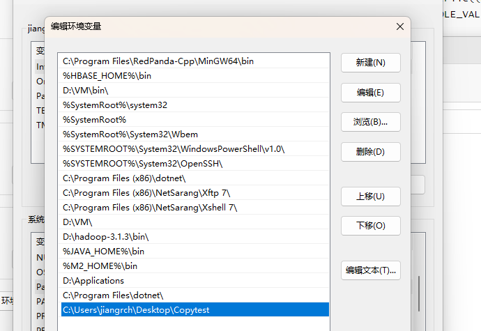
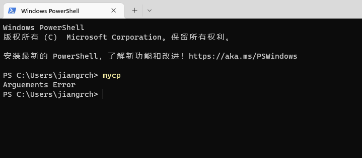
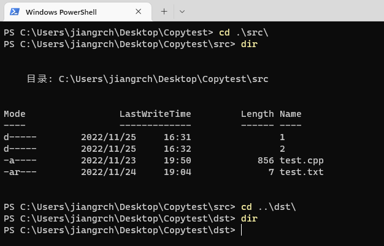
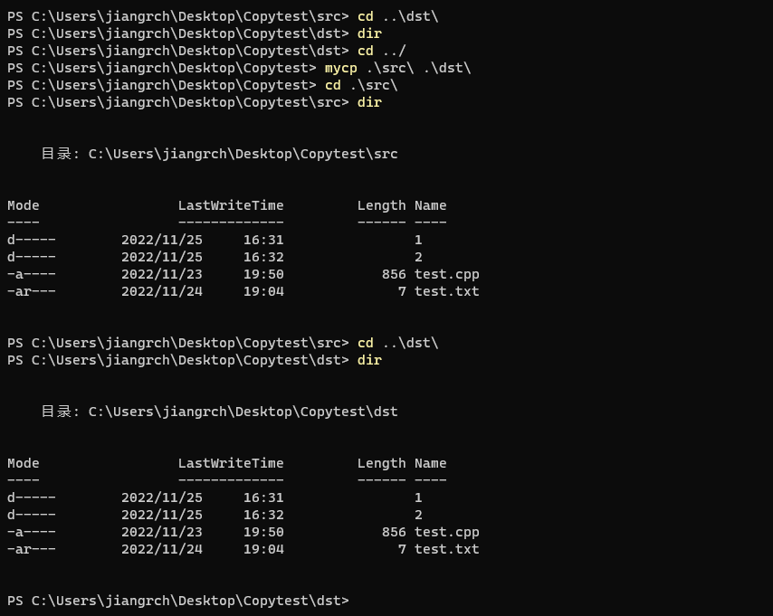
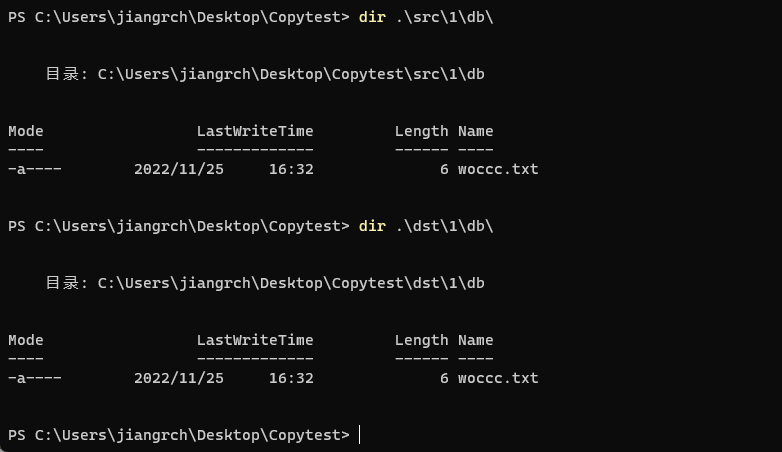
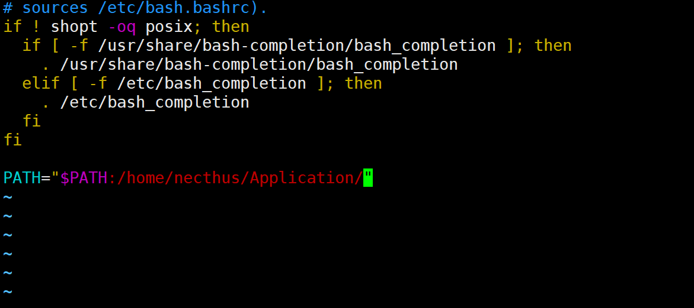
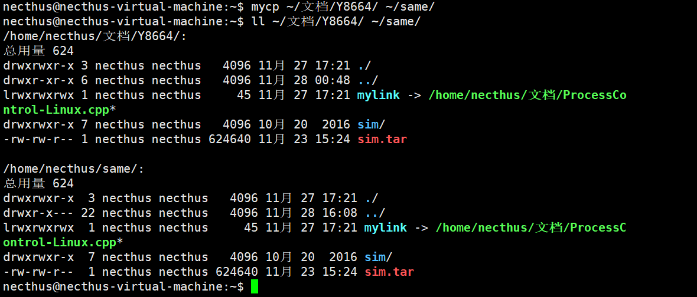
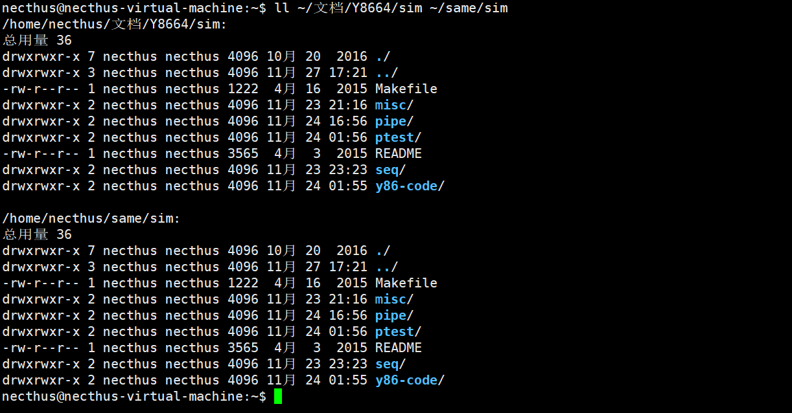
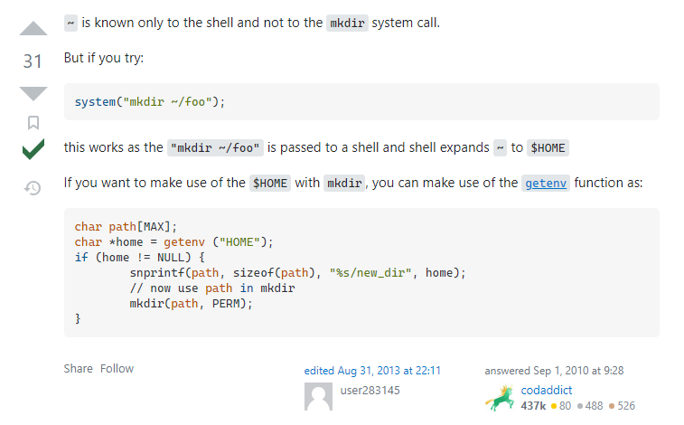

# 操作系统课程设计实验报告

实验名称：复制文件

## 一、实验目的

本实验通过编写C语言程序，调用Windows和Linux提供的系统级API，实现Windows和Linux下的文件复制，更好地了解了文件复制的过程以及调用。

## 二、实验内容

完成一个目录复制命令`mycp`，包括目录下的文件和子目录

说明：
Linux: `create`，`read`，`write`等系统调用，要求支持软链接

Windows: `CreateFile()`, `ReadFile()`, `WriteFile()`, `CloseHandle()`等函数

特别注意复制后，不仅读写权限一致，而且时间属性也一致。

## 三、实验环境

**Windows环境**

- Windows 11 WorkStation 21H2 

- GCC 11.2.0

- Red Panda C++ 2.4

**Linux环境**

- Ubuntu 22.04.1
- GCC 11.2.0
- Remote SSH Visual Studio Code
- Xshell 7

## 四、程序设计与实现

### Windows

#### `CreateFile`

Windows下通过`CreateFile`函数得到文件或者目录的句柄

```c
HANDLE CreateFile(
  LPCTSTR lpFileName,//文件名，包含路径
  DWORD dwDesiredAccess,//访问类型
  DWORD dwShareMode,//共享方式
  LPSECURITY_ATTRIBUTES lpSecurityAttributes,//指向安全属性的指针
  DWORD dwCreationDisposition,//创建文件的方式
  DWORD dwFlagsAndAttributes,//属性和标志
  HANDLE hTemplateFile//指定一个文件，可以继承扩展属性
);
```

函数返回文件或目录的句柄

`dwCreationDisposition`参数常用的值有两种:

- `CREATE_ALWAYS`：文件不存在则创建，存在则覆盖
- `OPEN_EXISTING`：打开已有文件，不存在则报错

如果要得到目录的句柄，需要指定`dwFlagsAndAttributes`参数为`FILE_FLAG_BACKUP_SEMANTICS`


#### `ReadFile`和`WriteFile`

读取文件内容可以采用`ReadFile`，返回布尔值记录读取是否成功

```c
BOOL ReadFile(
  HANDLE       hFile,//指向文件的句柄
  LPVOID       lpBuffer,//存放文件内容的缓冲区
  DWORD        nNumberOfBytesToRead,//文件的字节数
  LPDWORD      lpNumberOfBytesRead,//指向一个变量，用于记录读取了多少字节
  LPOVERLAPPED lpOverlapped//读写指针的位置，通常可以设为nullptr
);
```

写文件可以采用`WriteFile`，返回布尔值记录写入是否成功

```c
BOOL WriteFile(
  HANDLE       hFile,//指向文件的句柄
  LPCVOID      lpBuffer,//要写入内容的缓冲区
  DWORD        nNumberOfBytesToWrite,//文件的字节数
  LPDWORD      lpNumberOfBytesWritten,//指向一个变量，用于记录读取了多少字节
  LPOVERLAPPED lpOverlapped//读写指针的位置，通常可以设为nullptr
);
```

调用实例如下，其中`GetFileSize`是获取文件大小函数

```c++
//获取文件大小
DWORD file_size = GetFileSize(hSrcFile,nullptr);
//创建缓冲区
LPVOID buffer = malloc(file_size);
DWORD read_num=0;
//从源文件读写到目标文件
ReadFile(hSrcFile,buffer,file_size,&read_num,nullptr);
WriteFile(hDstFile,buffer,file_size,&read_num,nullptr);
```


#### 时间和属性

一共有四个函数，获取与设置属性，获取与设置时间，函数较为简单，调用过程如下

```c++
void CopyAttribute(string src,string dst,HANDLE hSrc,HANDLE hDst)
{
	DWORD attribute = GetFileAttributes(src.c_str());
	SetFileAttributes(dst.c_str(),attribute);
	FILETIME creation_time,access_time,write_time;
	if(!GetFileTime(hSrc,&creation_time,&access_time,&write_time))
	{
		cout<<src<<" get file time error."<<endl;
	}
	if(!SetFileTime(hDst,&creation_time,&access_time,&write_time))
	{
		cout<<dst<<" set file time error."<<endl;
	}
	return;
}
```

其中，`creation_time`,`access_time`,`write_time`分别为文件或者目录的创建时间、最后读取时间、最后修改时间


#### 遍历目录

我们采用递归调用自定义函数的方法遍历目录并进行复制，遍历过程中，遇到文件就复制，遇到目录就再调用遍历函数

首先调用`FindFirstFile`函数

```c++
HANDLE FindFirstFile(
  LPCSTR             lpFileName,//带通配符的目录名称
    							//例如，搜索当前目录下所有文件的参数为：./*
  LPWIN32_FIND_DATA lpFindFileData//指向文件数据结构体的指针
);
```

函数将会将第一个文件和目录的信息填充到文件数据结构体中，返回一个目录搜索句柄，用在下面的函数`FindNextFile`上

注意的是，`lpFileName`必须带通配符，不能只是单纯的目录形式。

```c++
BOOL FindNextFile(
  HANDLE             hFindFile,//获得的搜索句柄
  LPWIN32_FIND_DATA lpFindFileData//指向文件数据结构体的指针
);
```

返回值判断寻找下个文件或目录是否成功，可以用于判断循环

```c++
//文件数据
WIN32_FIND_DATA file_data;
//获取第一个文件句柄
HANDLE hFirstFile=FindFirstFile((src+"*").c_str(),&file_data);
if(hFirstFile==INVALID_HANDLE_VALUE) printf("error\n");
do
{
//循环内容
}while(FindNextFile(hFirstFile,&file_data));
//关闭首文件句柄
FindClose(hFirstFile);
return ;
```

特别要注意的是，遍历目录时，将会遍历到两个特殊目录 `.`以及`..`，代表当前目录和上一级目录。。。continue即可


#### 判断是否为文件夹

`WIN32_FIND_DATA`中有一个属性`dwFileAttributes`，按位标志着文件的属性。其中有一位标志是否为文件夹（目录），只要将这个属性值与宏定义`FILE_ATTRIBUTE_DIRECTORY`作按位与，不为0即是文件夹


#### 环境变量

要在命令行中输入命令和参数就可复制文件，需要将可执行文件的路径添加进环境变量路径中。

以我个人的实验为例



输入`mycp`命令，成功识别可执行文件，因为没有提供参数，所以出现提示




#### 运行截图

进入测试文件夹`CopyTest`，初始，src文件夹有文件，dst文件夹无文件



提供参数并运行，文件目录以及属性都成功复制，多级目录下的文件也成功复制





### Linux

#### 文件复制

##### `open`

利用`open`函数可以方便地打开和创建文件，头文件`unistd.h`

```c++
int open(
    const char *pathname, //文件名
    int flags,//打开方式
    mode_t mode//可选参数，代表创建文件的访问权限
);
```

函数返回一个文件描述符

`flags`通常指定为下面的参数之一

- `O_RDONLY` 只读打开     
- `O_WRONLY` 只写打开    
- `O_RDWR` 可读可写打开

这些参数可以与一些使用附加参数，`O_CREAT` `O_EXCL` `O_APPEND` `O_TRUNC` 

实验中，可以用`open`函数创建文件，附带`O_CREAT`参数即可，意为文件不存在则创建文件；同时指定 `O_TRUNC` 参数，简单理解就是文件存在则清空（本实验拟定复制文件覆盖原来的文件，故清空）

当指定了`O_CREAT`参数时，需要给出第三个参数`mode`的值，作为此文件的访问权限。实验采用`0777`，意味所有用户和组都能对文件进行任意操作，方便后续对文件再进行操作。`mode_t`在文件相关函数中经常用到。

函数调用如下

```c++
const int src_fd = open(src,O_RDONLY);
const int dst_fd = open(dst,O_RDWR | O_CREAT|O_TRUNC,0777);
```


##### `read`和`write`

要读取文件的内容，采用`read`函数，头文件`fcntl.h`

```c++
ssize_t read(
    int fd, //待读取文件描述符
    void *buf, //存放读取内容的缓冲区
    size_t count//一次读取多少字节，通常可设置为缓冲区的大小
);
```

函数返回实际读取了多少字节；当到达文件末尾时，再次调用，返回0；当文件读取不成功时，返回-1。此函数实际上操作的是文件的读写指针。


要将内容写入新文件，采用`write`函数

```c++
ssize_t write(
    int fd, //待读取文件描述符
    void *buf, //存放读取内容的缓冲区
    size_t count//一次读取多少字节，通常可设置为缓冲区的大小
);
```

返回值与`read`相似，只不过是成功写入的字节数。


将`read`和`write`结合起来就可以实现文件复制。

因缓冲区的大小是有限的，而文件的大小是无限的，决定了我们必须要多次调用函数对，代码实现如下

```c++
int len;
//读取多少就写入多少，读取不出来则停止循环
while((len=read(src_fd,buf,sizeof(buf)))>0)
{
    write(dst_fd,buf,len);
}
```

##### `readlink`和`symlink`

实验中要求支持软链接复制，即符号链接。这是一种特殊的文件，指向一个已存在的文件，软链接文件中储存着这个文件的目录。

类似于普通文件的读取写入，软链接文件也有读取写入函数，头文件`unistd.h`

```c++
ssize_t readlink(
    const char *pathname,//读取软链接路径加文件名
    char *buf,//读取内容存放缓冲区
    size_t bufsiz//缓冲区大小
); 
```

符号链接的内容（即所指文件路径，为绝对路径）将存到缓冲区。如果存不下，内容将会被截断，所以缓冲区尽量大一点。但不必太大，因为路径长度是有限制的。

函数返回读取到多少字节数，失败返回-1。需要注意，存到缓冲区中的文件路径字符串并不以终止符0结尾，但因为有返回值，我们可以人工添加字符串末尾的0，避免一些错误。

写入函数如下，可以创建新软链接文件

```c++
int symlink(
	const char *target,//要创建的软链接文件
    const char *linkpath//链接所指向的文件路径
);
```

函数成功返回0，不成功返回-1。

函数使用如下

```c++
int end=readlink(full_src_name.c_str(),buf,sizeof(buf));
buf[end]=0;//人工添加0
symlink(buf,full_dst_name.c_str());
```


#### 属性复制

以下文件、目录、链接统称为文件

文件的属性可以由一个结构体`struct stat`描述

```c++
struct stat {
    mode_t     st_mode;       //文件对应类型，访问属性等
    ino_t      st_ino;       //inode节点号
    dev_t      st_dev;        //设备号码
    dev_t      st_rdev;       //特殊设备号码
    nlink_t    st_nlink;      //文件的连接数
    uid_t      st_uid;        //文件所有者
    gid_t      st_gid;        //文件所有者对应的组
    off_t      st_size;       //普通文件，对应的文件字节数
    time_t     st_atime;      //文件最后被访问的时间
    time_t     st_mtime;      //文件内容最后被修改的时间
    time_t     st_ctime;      //文件状态改变时间
    blksize_t st_blksize;    //文件内容对应的块大小
    blkcnt_t   st_blocks;     //文件内容对应的块数量
};
```

获取文件的属性可以采用函数`lstat`，头文件`sys/stat.h`

```c++
int lstat(
    const char *pathname,//文件路径
    struct stat *statbuf//存放属性的结构体
);
```

另外还有两个函数`stat`和`fstat`，区别在于，当碰到软链接时，`stat`函数获取指向的文件的属性，`lstat`函数获取软链接文件本身的属性。而`fstat`函数传入的不是文件路径，而是文件描述符，通过文件描述符获取属性。因为本实验要修改软链接文件的属性，所以采用`lstat`

我们需要复制源文件的三类类属性到目标文件：读写权限、所属用户和组以及各种时间属性。前面两者分别采用函数`chmod`和`chown`，分别是change mode和change owner的简写，容易理解。

```c++
int chmod(
    const char *pathname,//文件路径
    mode_t mode //读写权限，对应stat.st_mode
);
```

```c++
int chown(
	const char *pathname,//文件路径
    uid_t owner,//所属用户，对应stat.st_uid
    gid_t group//所属组，对应stat.st_gid
);
```

我们只需要将`struct stat`相应的成员传入函数即可。

对于时间属性，`struct stat`中有三个关于时间的值

- `t_atime`   文件最后被访问的时间
- `st_mtime` 文件内容最后被修改的时间
- `st_ctime` 文件状态改变时间

其中，好像只能修改前面两个值，文件状态改变时间似乎不能通过常规方法修改

对于时间属性的修改，普通文件以及目录调用函数如下，头文件`utime.h`

```c++
int utime(
    const char * filename, //要修改时间的文件路径
    struct utimbuf * buf //结构体
);

struct utimbuf{
    time_t actime;
    time_t modtime;
};
```

`utimbuf`有两个成员，可以传递`stat`相关属性后传递给`utime`函数。需要注意的是，`stat`有名为类型为`timespec`的成员`st_atim` `st_mtim`，而`st_atime`是指向`timespec`结构体中`tvsec`成员的宏。要么直接使用宏获得秒数，要么使用`timespec`中的`tvsec`。

而如果是链接文件，需要用另外一个函数`lutimes`，否则会对链接指向文件进行修改，而不是链接文件本身。

```c++
int lutimes (
    const char *__file,//文件路径
    const struct timeval __tvp[2]//timeval数组
)；
```

函数同样成功返回0，不成功返回-1。这里要注意`time_t` `timeval` `timespec` 之间的转换关系。


#### 遍历目录以及判断文件类型

与Windows一样，可以采用递归的方式遍历目录。对于文件或者链接文件，复制并且复制属性；对于目录，创建后作为参数继续深入遍历。

如前面所说，`struct stat`中的`st_mode`储存了一些属性，其中就包括文件的类型（目录，普通文件，链接文件等）。

在Linux中，定义了一些宏，可以方便地判断文件的类型

- `S_ISDIR()`判断是否为目录
- `S_ISLNK()`判断是否为链接文件

遍历目录采用下面的函数，头文件`dirent.h`

```c++
DIR *opendir (
    const char *__name//目录路径
);//返回指向目录类型DIR的指针

struct dirent *readdir (
    DIR *__dirp//传递由opendir返回的指针
)；//返回一个struct dirent指针
```

`struct dirent`是一个结构体类型，里面含有成员`d_name`，记载着文件名

此函数需要反复调用，顺序返回目录下面的子目录或文件，当返回值为NULL时，代表遍历完成。


#### 环境变量

要随时调用命令，也需要将可执行文件的目录加入环境变量的路径中。

打开`~/.bashrc`，添加一行，是自己创建的一个应用文件夹，之后`source`一下




#### 运行截图

调用`mycp`命令，实现`~/文档/Y8664/ ` 到 `~/same/`的复制



次级目录复制结果如图



文件、目录、软链接都正确复制

## 五、实验收获与体会

本次实验通过调用Windows、Linux中的API完成了文件的复制以及属性的复制。我在实验中遇到了一些困难，但解决了，并有所收获。具体困难如下：


### `mkdir`不能识别`~`

在编写代码的过程中，为了方便，没有采取命令行传参的方式，而是直接给路径赋值

```c++
string src="../Y8664/";
string dst="~/same/";

mkdir(dst.c_str(),0777);
```

其中， `mkdir`函数无法正确创建相应路径，提示无相应路径。这非常奇怪，因为用户路径`~`一定存在，不可能出现没有父目录的情况。直接查阅StackOverflow网站，找到了问题所在。



`~`只能在shell中使用，类似于一种宏，指向`$HOME`环境变量，执行时，自动将`~`替换为用户路径。在C语言编程中，不能直接用`~`，如必须要使用，手动编写函数将其替换为`$HOME`


### `lutimes`设置链接文件时间失败

使用`lutimes`函数设置时间返回-1，查阅`errno`，错误值为22，意思是`Invalid Argument`。路径名检查正确，那么只能是传入的`struct timeval`数组出现了问题。`timeval`的`tv_sec`被设置为相应秒值，有可能是`tv_usec`成员没有被设置的缘故。当纳秒值设置为0时，`lutimes`正常运行。一个合理的猜想是`tv_usec`成员的值过大，本来是精确修正的值失效，会导致函数失败。


本次实验要调用很多函数API，很容易就出错，Windows上，及时`GetLastError`；Linux上，及时查阅`errno`，弄清楚错误的具体原因并分析，有思路地去解决问题。可以适当向网上求助，本次实验的许多问题我都是在StackOverflow网站得到解决的。
